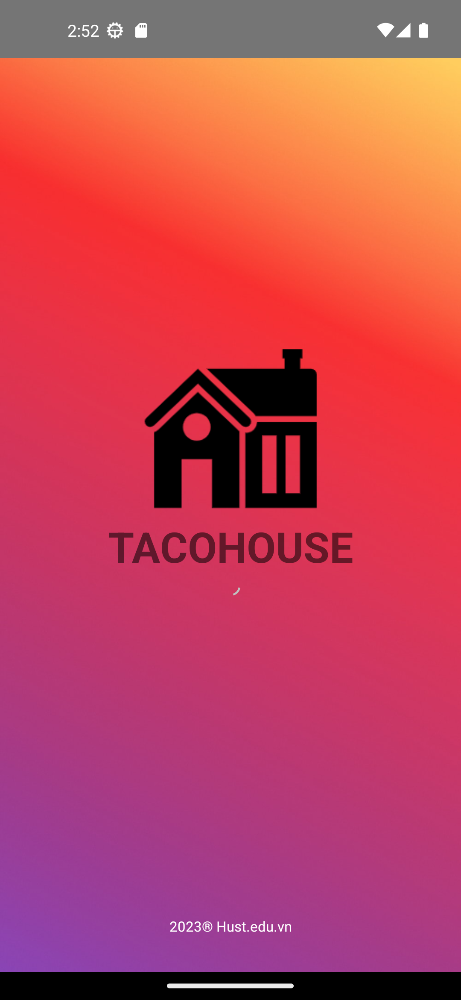
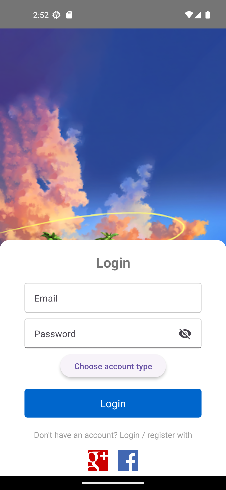
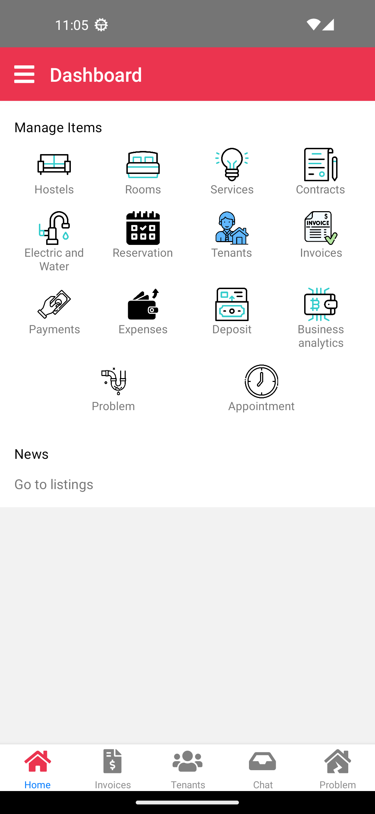
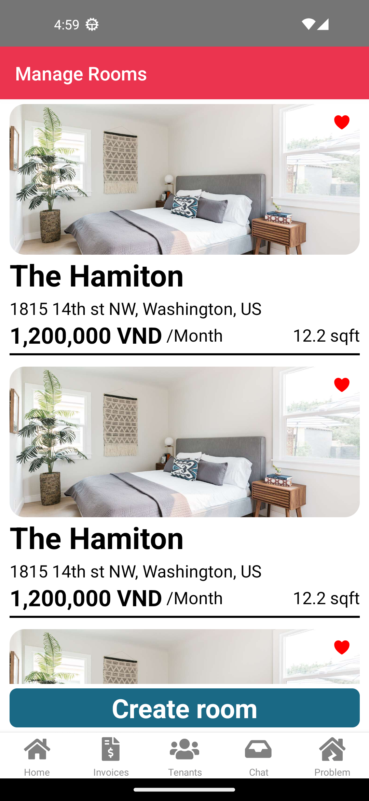
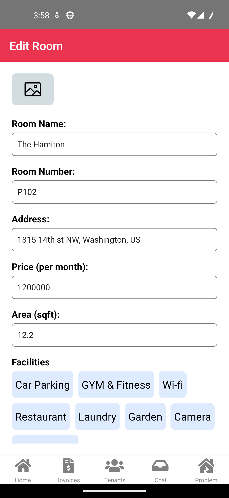
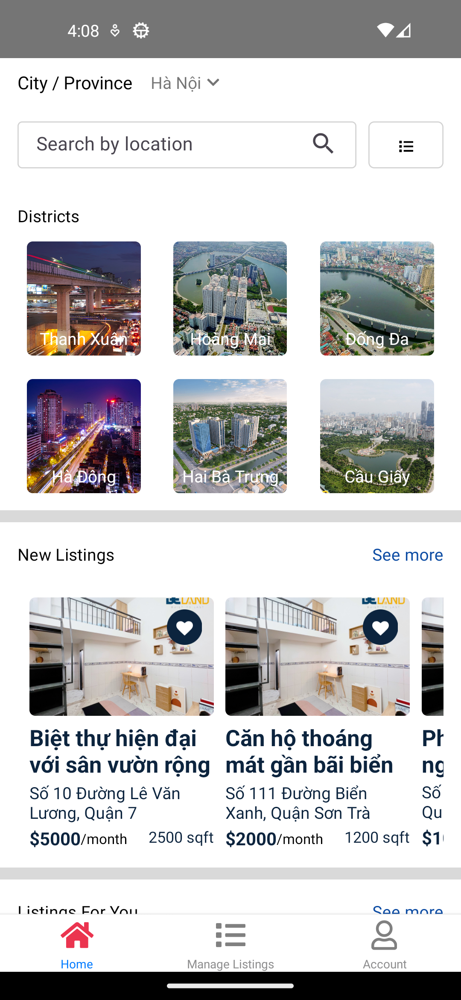
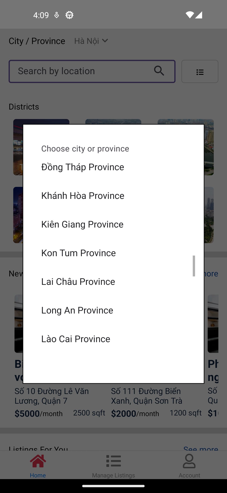
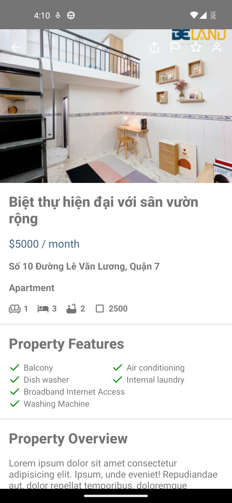

# Install introduction

## when run: npx react-native start:  have this: Error: spawn ./gradlew EACCES
```agsl
chmod 755 android/gradlew
```

# Run app

```
npx react-native start
<!-- or --> select android = hit a key
yarn react-native start
```

## Install library
```
yarn add react-native-image-picker
<!-- or -->
npm install react-native-image-picker
```

# Screen images
<div style="display: grid; grid-template-columns: repeat(3, 1fr); grid-gap: 10px;">














</div>